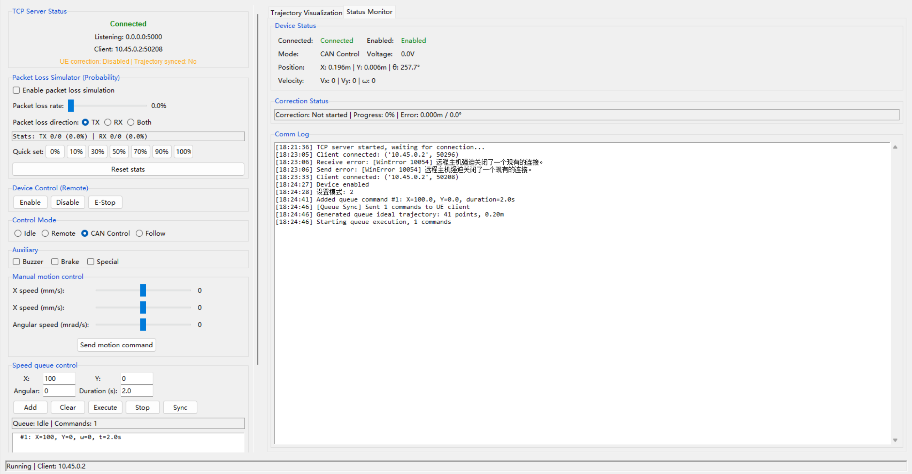
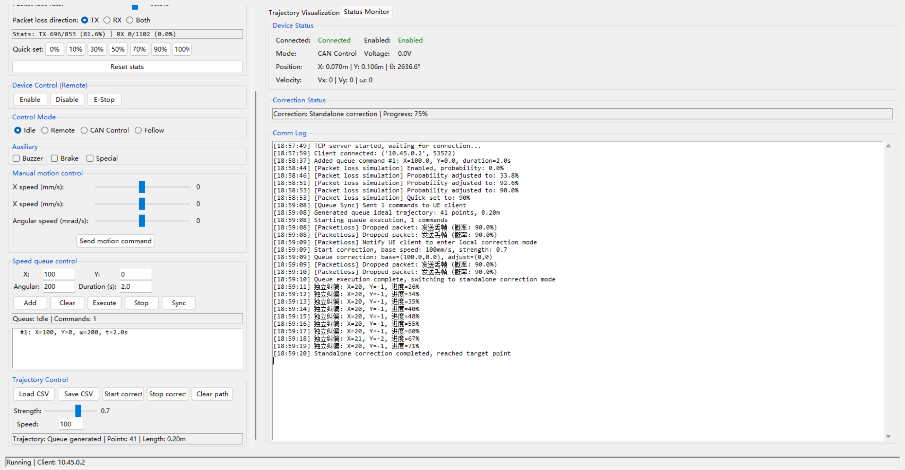
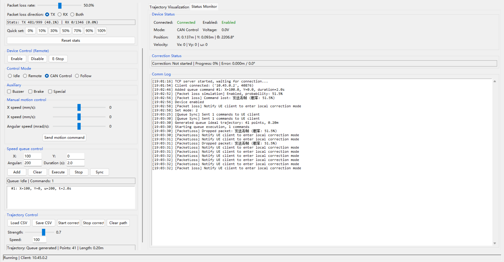
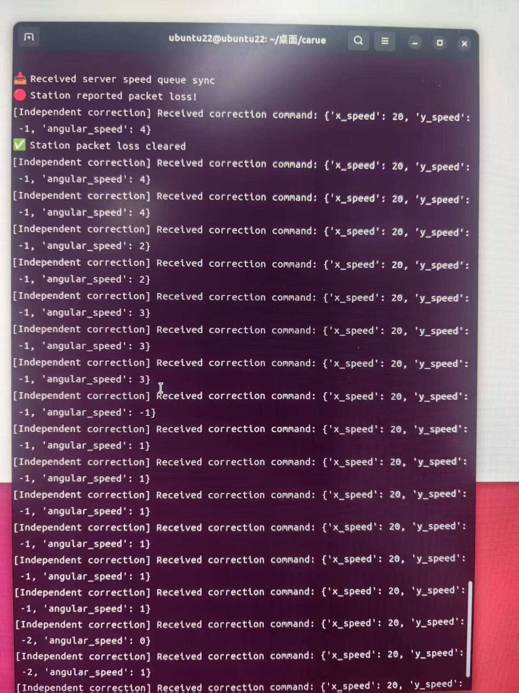
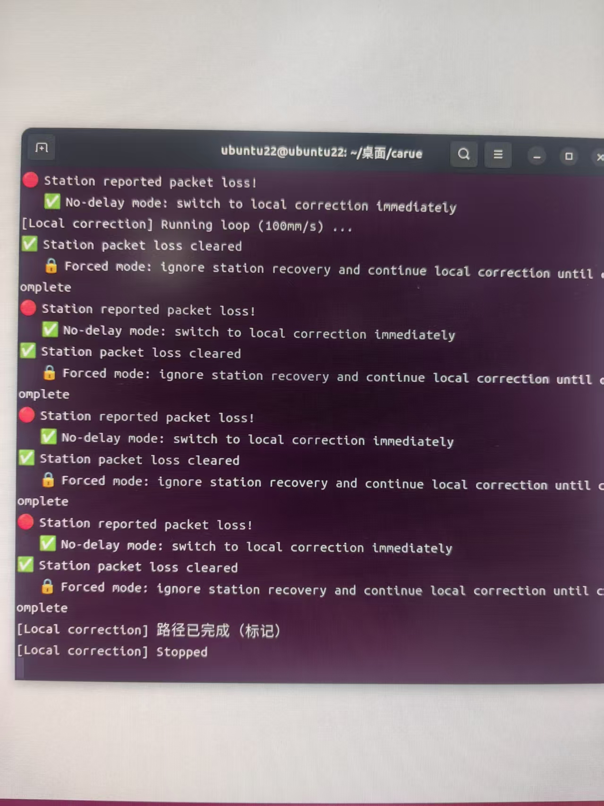
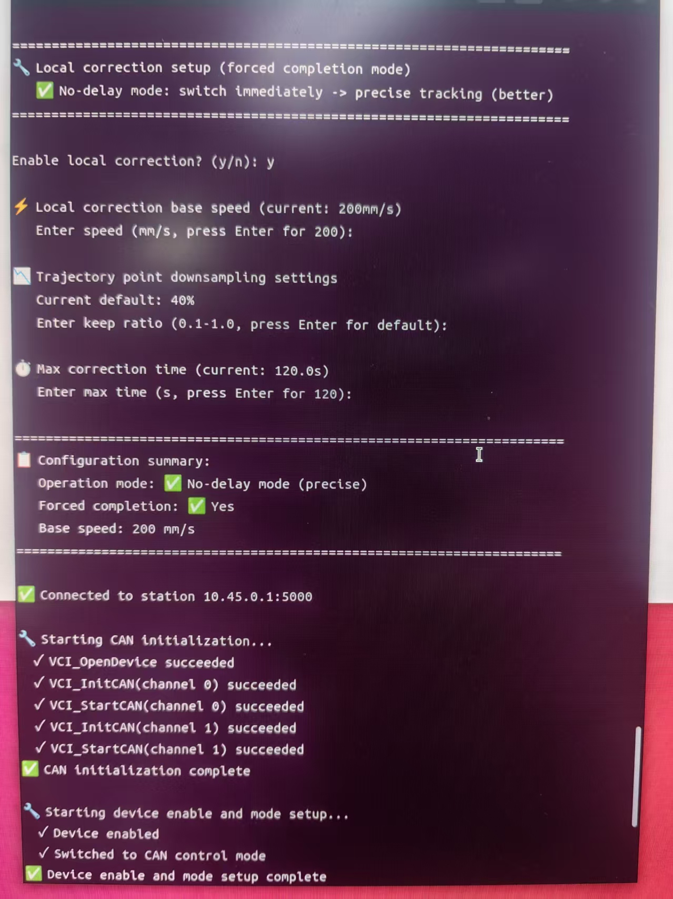
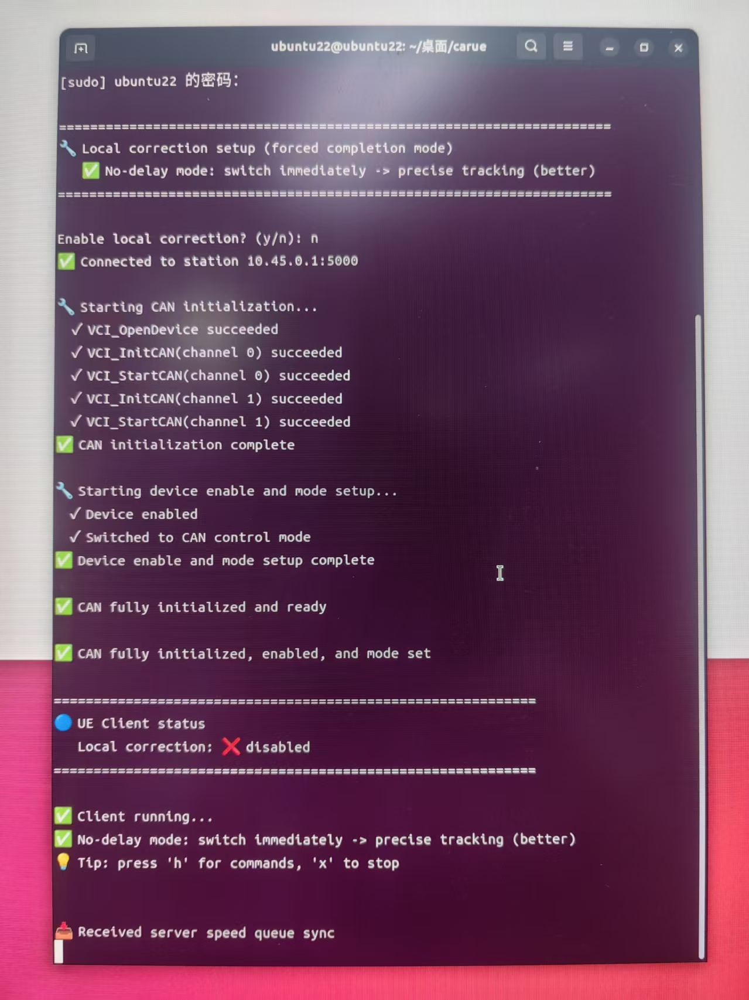
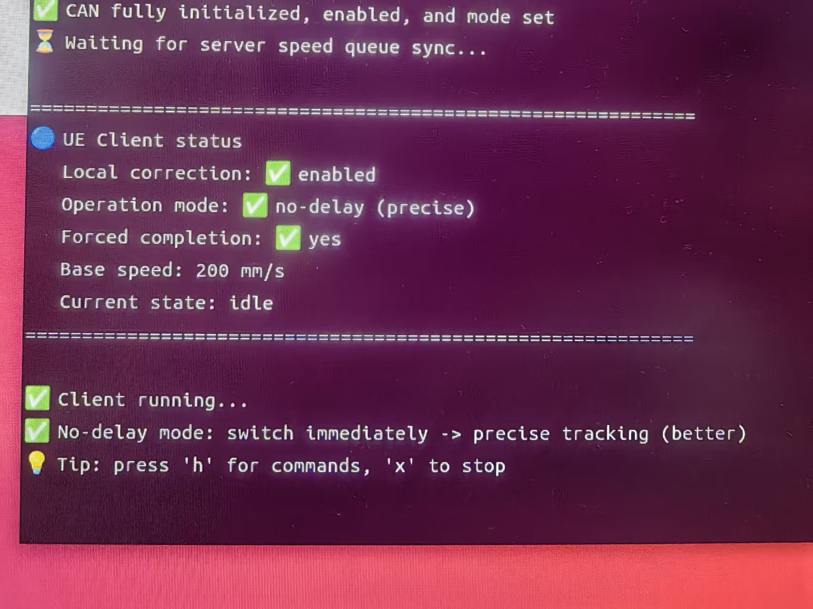
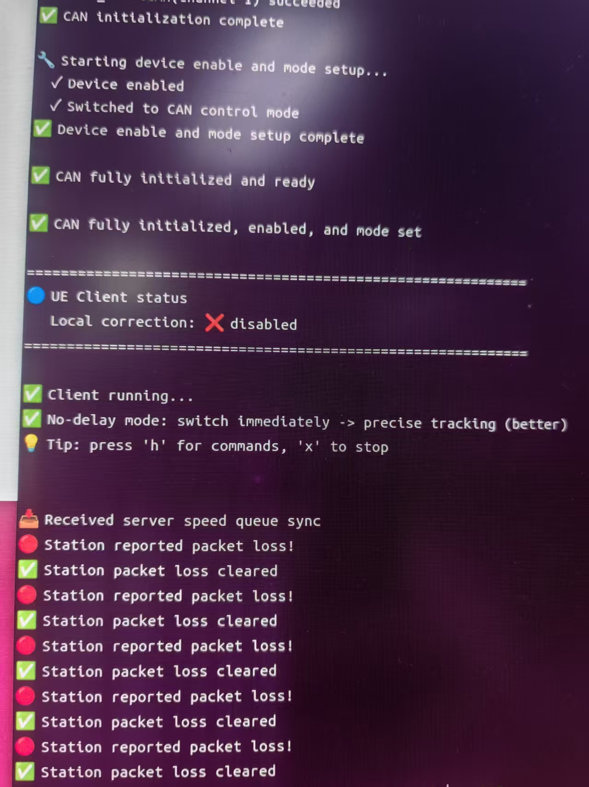

# 🚗 Remote Car Control System — Network Packet Loss Compensation & Trajectory Correction

A TCP-based remote car control platform featuring **packet loss simulation**, **base station correction**, and **local no-delay correction** to ensure trajectory tracking accuracy in weak network environments.

---

## 📸 Project Screenshots

### Base Station Main Control Interface (Normal Operation)


### Packet Loss + Base Station Correction Process


### Packet Loss + Local Correction Process


### Base Station Correction Terminal Logs


### Local Correction Runtime Logs


### Local Correction Configuration Interface


### Local Correction Disabled (Initial Setup)


### Local Correction Status & Parameters


### Logs After Packet Loss at Startup


---

## ✨ Key Features

- **🌐 TCP Remote Control**: Base station (Ubuntu GUI) communicates in real-time with the UE client (Ubuntu) via TCP
- **📉 Packet Loss Simulation**: Customizable TX/RX packet loss rates for testing in weak network environments
- **🎯 Dual-Mode Correction**:
  - **Standalone Correction (Base Station)**: The base station calculates compensation speeds and sends them to the UE
  - **Local Correction (UE Side)**: The UE switches immediately with no delay, forcing trajectory completion with higher accuracy
- **🔄 No-Delay Mode**: Upon detecting packet loss, the system switches to local compensation instantly without waiting for base station recovery
- **📐 Trajectory Queue Control**: Supports speed queue control and ideal trajectory generation (41-point interpolation, 0.20m path)
- **🔧 CAN Bus Lower Computer**: The UE side controls the car chassis via dual-channel CAN bus

---

## 🏗️ System Architecture

```
┌─────────────────┐                      ┌──────────────────┐
│  Base Station   │  ←──── TCP ────→     │   UE Client      │
│  (Ubuntu  GUI)  │   10.45.0.1:5000     │ (Ubuntu / Python)│
│                 │                      │                  │
│ • Trajectory Viz│                      │ • CAN Init       │
│ • Packet Loss   │                      │ • Local Engine   │
│   Simulator     │                      │ • Forced Mode    │
│ • Speed Queue   │                      │ • Downsample     │
│ • Correction    │                      │   Tracking       │
│   Algorithm     │                      │                  │
└─────────────────┘                      └──────────────────┘
                                                │
                                         ┌──────┴──────┐
                                         │   CAN Bus   │
                                         │ Channel 0/1 │
                                         └──────┬──────┘
                                                │
                                          ┌─────┴─────┐
                                          │Car Chassis│
                                          │(Motor/Enc)│
                                          └───────────┘
```

---

## 🚀 Quick Start

### Launch

**Step 1: Start the Base Station (Server)**
```bash
cd carBS
python3 station_server.py
# The GUI will automatically listen on 0.0.0.0:5000
```

**Step 2: Start the UE Client**
```bash
cd carUE
sudo python3 ue_clientLX.py
# sudo privileges are required for CAN device access
```

---

## ⚙️ Configuration

### Base Station (Server GUI)

| Parameter | Description |
|-----------|-------------|
| **Packet Loss Rate** | Simulated packet loss probability (0% - 100%) |
| **Packet Loss Direction** | TX / RX / Both |
| **Control Mode** | Idle / Remote / CAN Control / Follow |
| **Speed Queue** | X, Y, Angular velocity + duration |
| **Trajectory Control** | Strength: correction intensity (0.0-1.0); Speed: base correction speed |

### UE Client (Local Correction Setup)

| Parameter | Description |
|-----------|-------------|
| **Enable local correction** | `y` to enable local correction; `n` for base-station-only control |
| **Operation mode** | No-delay mode: switch immediately → precise tracking |
| **Forced completion** | Whether to force trajectory completion (ignoring base station recovery) |
| **Base speed** | Local correction base speed (default: 200 mm/s) |
| **Downsampling** | Trajectory point downsampling ratio (default: 40%) |
| **Max correction time** | Maximum correction timeout (default: 120s) |

---

## 📊 Three Operating Modes

### Mode 1: Ideal Environment (No Packet Loss)
- The base station sends the speed queue, and the UE executes it precisely
- Trajectory sync status: `Trajectory synced: Yes`

### Mode 2: Packet Loss + Base Station Correction
- When `TX` packet loss exceeds the threshold, the base station detects the loss
- The base station enters **Standalone Correction**, calculating compensation speeds (e.g., `x_speed=20, y_speed=-1`)
- The UE receives and executes the correction commands
- Real-time progress display: `Progress: 75%`

### Mode 3: Packet Loss + Local Correction (Recommended)
- The UE client enables **Local Correction**
- Once packet loss is detected (`Station reported packet loss!`), it switches immediately with no delay
- The local closed-loop system tracks the ideal trajectory without relying on real-time base station commands
- Even if the base station recovers, **Forced mode** can ignore the recovery and continue until the local trajectory is complete

---

## 📝 Key Log Interpretation

### Base Station Logs
```
[18:59:08] [PacketLoss] Dropped packet: 发送丢帧 (probability: 90.0%)
[18:59:09] [PacketLoss] Notify UE client to enter local correction mode
[18:59:09] Start correction, base speed: 100mm/s, strength: 0.7
[18:59:11] Standalone correction: X=20, Y=-1, progress=26%
[18:59:20] Standalone correction completed, reached target point
```

### UE Terminal Logs
```
🔴 Station reported packet loss!
✅ No-delay mode: switch to local correction immediately
[Local correction] Running loop (100mm/s) ...
✅ Station packet loss cleared
🔒 Forced mode: ignore station recovery and continue local correction until complete
[Local correction] Path completed (marked)
[Local correction] Stopped
```

---

## Packet Loss Simulation Mechanism

### Overview

The `PacketLossSimulator` is a flexible channel degradation simulator designed to emulate packet loss scenarios in communication systems. It supports multiple loss modes ranging from simple probabilistic dropping to intelligent task-group-based loss, enabling systematic testing of error recovery and correction strategies.

### Core Concepts

#### 1. Basic Loss Mode
At its foundation, the simulator operates on a configurable probability basis:

- **Loss Probability**: A value between `0.0` and `1.0` that determines the likelihood of dropping a packet.
- **Direction Control**: Three directional modes are supported:
  - `DIRECTION_TX_ONLY` — drops only outgoing (transmit) packets.
  - `DIRECTION_RX_ONLY` — drops only incoming (receive) packets.
  - `DIRECTION_BOTH` — drops packets in both directions.

In this mode, each packet is evaluated independently using a random draw against the configured probability.

#### 2. Queue Task Loss Mode
For systems that operate on sequential command queues (e.g., robot motion control), the simulator provides an intelligent **queue loss mode** that operates on **task groups** rather than individual packets.

**Task Group Analysis**: The simulator analyzes a speed command queue and automatically segments it into logical task groups based on velocity changes. A new task group is created when the speed in any direction changes by more than a threshold (absolute delta > 50 or relative change > 20%). Each group is characterized by:
- A unique `group_id`
- A descriptive label (e.g., "Forward 100mm/s + Left 50mm/s")
- Command index range and duration
- Dominant velocity components

**Loss at Transitions**: When queue loss mode is enabled, packet loss is evaluated **only at task group transitions** (i.e., when the system is about to switch from one motion task to another). This models realistic scenarios where channel degradation causes an entire upcoming maneuver to be lost, not just sporadic individual commands.

#### 3. Targeted Loss Mode
For reproducible testing, the simulator supports **targeted loss mode**, allowing you to specify exactly which task groups should be dropped:

- Provide a list of `task_group_ids` to mark as loss targets.
- Configure a dedicated `target_loss_probability` for these groups (independent of the base probability).
- Useful for regression testing specific failure scenarios.

#### 4. Manual Trigger Mode
In addition to automated probabilistic loss, the simulator supports **manual triggering**:

- Call `trigger_manual_loss_for_task_group(group_id)` to force the loss of a specific upcoming task group.
- The manual trigger takes **highest priority** over random and targeted modes.
- After firing, the trigger resets automatically.

#### 5. Correction & Recovery Integration
When a task group loss is detected at a transition point, the simulator can interact with the host system via an optional GUI callback:

- **User Decision**: A dialog prompts whether to start the correction routine immediately or continue with the current task group.
- **Early Correction Flag**: If the user chooses to correct immediately, `correction_started_early` is set to `True` and `queue_ended_by_loss` is set to `True`, signaling the main controller to abort the remaining queue and initiate recovery using the last known valid command.
- **Last Command Retention**: The simulator tracks the last successfully transmitted command (`last_command_data`) to serve as the baseline for recovery maneuvers.

#### 6. Loss History & Statistics
All loss events are recorded in a structured history log, including:

- Timestamp
- Task group ID and description
- Number of lost commands and total duration
- Loss reason and mode (`manual`, `target`, or `random`)
- Statistical aggregates: total packets, loss rates, average loss size, early correction flags

Statistics can be retrieved programmatically via `get_stats()` or as a formatted text summary via `get_stats_text()`.

### Usage Example

```python
from packet_loss_simulator import PacketLossSimulator

# Initialize with 10% base loss probability, TX-only
sim = PacketLossSimulator(loss_probability=0.1, direction=PacketLossSimulator.DIRECTION_TX_ONLY)
sim.enable()

# Analyze a command queue into task groups
speed_queue = [
    {'x': 100, 'y': 0, 'angular': 0, 'duration': 1.0},   # Group 0: Forward
    {'x': 100, 'y': 0, 'angular': 0, 'duration': 1.0},   # Group 0: Forward
    {'x': 0, 'y': 50, 'angular': 0, 'duration': 2.0},    # Group 1: Left
]
sim.analyze_task_groups(speed_queue)

# Enable queue loss mode for intelligent task-group dropping
sim.enable_queue_loss_mode()

# Optionally target specific groups for deterministic testing
sim.enable_target_loss_mode(task_group_ids=[1], probability=1.0)

# Or manually trigger a loss
sim.trigger_manual_loss_for_task_group(1)

# Simulate a transition between task groups
is_lost, start_correction, reason = sim.simulate_queue_loss(
    current_command=speed_queue[1],
    next_command=speed_queue[2],
    current_task_group=sim.task_groups[0],
    next_task_group=sim.task_groups[1],
    is_task_change=True,
    gui_callback=None  # Set to a Tkinter callback for interactive mode
)

if is_lost:
    print(f"Loss detected: {reason}")
    if start_correction:
        print("Initiating early correction...")
```

### API Summary

| Method | Description |
|--------|-------------|
| `set_loss_probability(p)` | Set base loss probability (`0.0`–`1.0`). |
| `set_direction(d)` | Set loss direction (`TX_ONLY`, `RX_ONLY`, `BOTH`). |
| `enable()` / `disable()` | Toggle the simulator on/off. |
| `analyze_task_groups(queue)` | Segment a speed queue into task groups. |
| `enable_queue_loss_mode()` | Enable intelligent task-group loss at transitions. |
| `enable_target_loss_mode(ids, p)` | Enable deterministic loss for specific task groups. |
| `trigger_manual_loss_for_task_group(id)` | Force loss of a specific upcoming group. |
| `simulate_queue_loss(...)` | Evaluate loss at a task transition point. |
| `simulate_tx_loss(data)` / `simulate_rx_loss(data)` | Legacy per-packet loss simulation. |
| `get_stats()` / `get_stats_text()` | Retrieve comprehensive statistics. |
| `get_loss_history_text(n)` | Retrieve the last `n` loss events. |
| `reset_stats()` | Clear all counters and history. |

---
